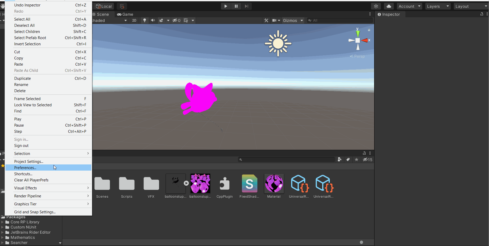
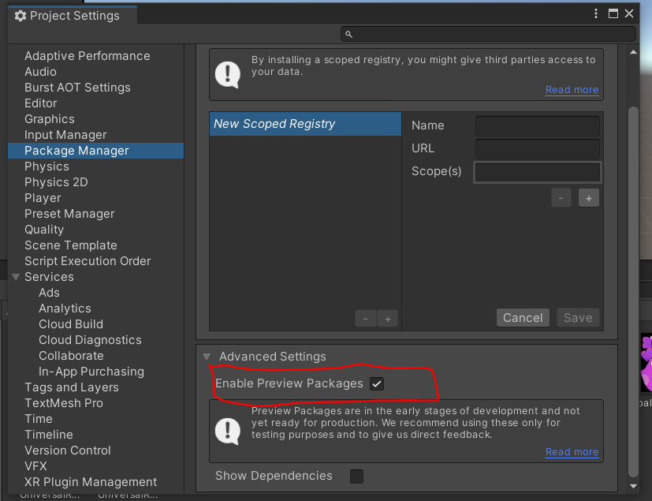

# Unity-Assessment

## 1. Problems

### 1.1 Shader

In order to check the shader you must disable the `Universal Render Pipeline` (TO DO: Add SRP compatibility to the shader adding the material properties to a CBUFFER named "UnityPerMaterial").
Once finish the test, please enable again the `Universal Render Pipeline` so VFX on bullet 1.4 can work properly.
The scene `1.1 Shaders` includes an object, a material and the extended shader. 
    

    
*Explanation:* Unity provides ***UnityCG.cginc***, a shader file that includes commonly used helper functions. ***ShadeSH9*** is a helper function from ***UnityCG.cginc*** that evaluates ambient and light probe data.    

### 1.2 C++ Plugin (FOR WINDOWS)

The `CppPlugin` folder contains the visual studio solution for windows with the C++ native code and the `CppPlugin.dll` file on `x64/Release` folder.
There is a copy of that `CppPlugin.dll` file on `Unity Assessment/Assets` folder on Unity project.
The scene `1.2 C Plugin` adds the script `CppPlugin.cs` to the main camera, and logs the concatenated string
    

*Explanation:* In order to create the plugin is important to define the application type as: *"DLL application"* and not use precompiled headers:

On the header file is defined the struct for `TwoStrings` and the function signature, the *.cpp* file just contains the logic to concatenate 2 strings. Then is possible to build the solution in release mode and for 64 bit platforms.    
The created *.dll* file should be copied to Unity's Assets folder, after that you can import the function using the `DllImport` attribute and call the plugin function.

### 1.3 Job System

The scene `1.3 RChannel` includes the script `R Channel`. That script calculates the sum of the red values in a texture, both in a single thread and using Unity's Job System.
On the gif you can see the workers being used when you enable the `Use Job System` toggle.
    

    
*Explanation:* Job system is one of the pillars of the new Unity Jobs tech stack, actually in Unity 2020+ is necessary to enable the Preview packages option on project settings in order to be able to include the *jobs* package.

The Jobs system handles all of the behind scenes stuff related to multithreading, so the user just needs to create jobs and schedule them.    
It's important to keep in mind that if the job returns a value you should use `NativeArray` from `Unity.Collections` and pass that object to the Job structure.    
Also keep in mind to *dispose* all `NativeArray` elements to avoid memory leaks.

### 1.4 VFX Bezier curve

Do not forget to enable the `Universal Render Pipeline` on project settings:

The scene `1.4 VFX Bezier` contains a visual effect asset that creates a particle system that moves along a cubic bezier curve
    

*Explanation:* The VFX runs on the GPU unlike the regular particle system that runs on the CPU. The Graph contain contexts and the user can add nodes to the graph.    
A Bezier curve is defined by a set of control points P0 through Pn, where n is called its order (n = 1 for linear, 2 for quadratic, etc.). The first and last control points are always the end points of the curve; however, the intermediate control points (if any) generally do not lie on the curve.

### 1.5 Prefab asset bundle

Not forget to disable the `Universal Render Pipeline`. The scene `1.5 Prefabs` loads 2 bundles and instantiates them on the scene.
    

*Explanation:* It's important that the script in charge of creating the asset bundle must be on the `Assets/Editor` folder.

## 2. Questions

### 2.1 Definitions:

***Scriptable Build Pipeline***     
It's a C# package with a predefined build flow for building AssetBundles. It can be used to control how Unity builds content. 

***Scriptable Render Pipeline***   
It's a feature that allows to control the rendering via C# scripts, the user can have more customization over the rendering process and performance resources. Can be used when a game requires specific rendering.

***Addressables***   
It's a unity package that provides an easy way to load assets asynchronously using an address. A good use case could be a mod system, so the user can load and unload mods on the game.

***IL2CPP***   
It's a Unity technology for compiling .NET assemblies to native platform. It has an AOT (Ahead of Time) compiler so the C# code is compiled to IL (Intermediate Language), then it's compiled to native code increasing performance and enabling crossplatform portability.

***Nested Prefabs***   
A prefab is a template for a collection of game objects and components, a prefab can be instantiated into a scene. Nested prefabs allows to include prefab instances as children inside other prefabs, while still maintaining a reference to their own prefab asset, so making a change to the parent prefab taht change will be reflected in all children

### 2.2 Problems of Unity’s non-incremental Garbage Collector.   
1. Whenever the garbage collector needs to perform garbage collection, it will stop the running program, and resume only when it has finished all its work, causing delays at arbitrary moments. This can become an issue as ii is not possible to sustain a consistent frame rate.
2. The programmer has little control when the garbage collection should be launched.

### 2.3 Unity LTS vs TECH release vs Beta vs Alpha
***Alpha:*** In this phase the software is not thoroughly tested and main contain several bugs and errors.   
***Betha:*** The software is feature completed but may contain known and unknown bugs.   
***TECH release:*** Consist of three major releases a year with new features and funcionality.
***LTS:*** Is the last TECH release of each year   

Depending on where you are in your development cycle, you may want either to try out new features (TECH release) or only to get bug fixes in the version you are using for a longer period without adding new features (LTS).

### 2.4 Preferred VCS
My preferred version control system is ***GIT** because it is a distributed revision control system, it's faster than other VCS and each instance of the source contains the entire history tree  which is helpful when there is no internet connection.    

### 2.5 Favorite IDE
Taking into account my background as a Front End developer my favorite IDE is Jetbrain's Webstorm because it works out of the box and mainly I have used mac OS so Webstorm works great on that OS, if I need to write C# code I use also Jetbrain's Rider IDE.

### 2.6 Unity's issues or limitations
1. The first thing is documentation, it could be better there are some concepts that lack documentation.
2. Sometimes the changes saved on the C# script are not updated on Unity
3. Maybe not a limitation but just how Unity works, once I needed to do a benchmark for a google maps mobile app using Unity and apache Cordova, Unity's build size was way bigger than apache cordova, so the end user would have heavier app. At the end the conclusion was that Unity is not the best choice for small and medium mobile apps (at least back at that time 2014)

### 2.7 Best practices to ptimize CPU and GPU
***CPU:***   
1. Cache references at initialization because calling some methods such as `GetComponent()` are expensive.
2.  `LINQ` generally requires more computation and memory than a manually written algorithm.
3.  Empty callback functions Unity operates back and forth between an unmanaged and managed code, so empty functions as `Update(){}`
4.  Avoid passing structs by value, when yuo pass a struct to a function their contents are copied into a newly created instance.  

***GPU:***    
1. Avoid full screen effects because can be expensive.
2. Optimize fragment shader, because it is executed once per pixel.
3. Optimize the model geometry in order to reduce the amount of triangles.
4. Try to use lightmapping to avoid create lighting that requires computation

### 2.8 How to investigate crashes ###
If you can afford Unity's ***Backtrace*** tool, you can use it, also you can use Unity's profiler.
Also I try to follow a plan:
1. Know the customer, so I can tell what devices/OS or browsers they are using.
2. Once I know how the customer uses the product I can start testing the application creating a smoke test.
3. If I know that there are new features on the application I can start doing a regression test checking for features released before, so I narrow down the possible issues.
4. Try to replicate the issue.
5. Try to replicate the issue on development environment.
6. Profile the application

### 2.9 Compare function and macro definition ###
In macros no type checking is done and thus use of macros can lead to errors/side-effects in some cases. One case when they produce different results or side effects could be for example:    
    `printf("%d", square(1+2));`
> ***Using macro*** Output: 5     
> ***Using function*** Output: 9

### 2.10 Package Manager ###
It's a package management system based on NPM. The packages are loaded into a separate folder structure, not the project assets folder, so they are not tracked by the version management system. Allows the separation of componnet assets from the project assets, as well as the improved ability to do version and dependency management.

If you don't want to use the package manager UI, you can use the Package Manager scriptin API: you can run `Client.Add("com.unity.textmeshpro@1.3.0")` and it will add the TextMesh pro version 1.3.0 package.

### 2.11 Function result ###
`int someFunction(int)` returns the number of ones (1) that the parameter as binary number contains, example: 255 will return 8 because 255 = 0x1111 1111 which have 8 ones. 100 will return 3 because 100 = 0x0110 0100 which have 3 ones.   

